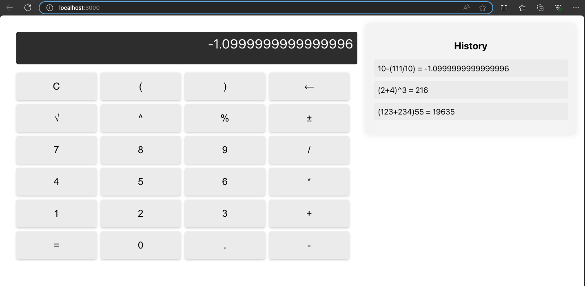

# Calculator Web App

## Overview
This project is a fully functional calculator web application built using React.js, HTML, and CSS. It allows users to perform a variety of mathematical operations, including basic arithmetic as well as more advanced calculations like percentages, square roots, and exponentiation. The app also supports history tracking and keyboard input, enhancing user experience and interaction.

## Technologies Used
- **Frontend:** React.js, HTML, CSS
- **Styling:** Custom CSS
- **Version Control:** Git, GitHub

## Features
- **Basic Arithmetic Operations:** Supports addition, subtraction, multiplication, and division.
- **Advanced Operations:** Includes support for percentages, square roots, exponentiation, and parentheses for grouping operations.
- **Clear Functionality:** Allows users to reset the calculator input.
- **Decimal Support:** Handles floating-point numbers in calculations.
- **Interactive Buttons:** Responsive UI with clickable buttons for digits and operations.
- **Keyboard Support:** Users can interact with the calculator via keyboard inputs.
- **History Feature:** Displays a log of previous calculations so users can refer to or re-use them.
- **Display:** Shows the current input or result of the calculations, with a secondary display for showing the history or input expression.

## Executed Window

## Learning Goals
- **State Management:** Utilize React's `useState` hook to manage the input, operator, result, and history states.
- **Event Handling:** Implement click and keyboard event handling to capture user interactions.
- **Mathematical Logic:** Implement the core logic for handling arithmetic operations, operator precedence, and advanced features like percentages, square roots, exponentiation, and parentheses.
  
## Pages Design
The web application has a clean and interactive interface:
1. **Calculator Display:** Shows the current input or result of the operation, and also shows the history of previous calculations.
2. **Calculator Buttons:** Includes digits (0-9), basic and advanced operators (+, -, *, /, %, √, ^), decimal point, and parentheses for grouping operations. Special buttons for clear (`C`) and equal (`=`) functions are also included.
3. **History Log:** A scrollable area where users can see their past calculations.

## Project Structure
- `src/`: Contains all React components.
  - `App.js`: Main component that renders the calculator and handles the application state.
  - `Calculator.js`: The component containing the main logic for the calculator.
  - `History.js`: Component for rendering the history log.
  - `App.css`: Styling for the calculator layout, buttons, and history log.
- `public/`: Static files like HTML and favicon.
- `package.json`: Lists project dependencies and scripts.
  
## Features Implemented
- **Percentages:** Calculate percentages by using the `%` button.
- **Square Roots:** Calculate square roots by using the `√` button.
- **Exponentiation:** Use the `^` button to raise numbers to a power.
- **Parentheses Support:** Group calculations using parentheses `(` and `)` to control operator precedence.
- **History Feature:** Users can see their calculation history and use past results in new calculations.
- **Keyboard Support:** The calculator fully supports keyboard input, allowing users to perform calculations without needing to click buttons.

## Future Enhancements
- **Memory Functionality:** Add memory functions like `M+`, `M-`, `MR`, and `MC` for storing and recalling values.
- **Scientific Calculator Mode:** Expand functionality to include trigonometric functions, logarithms, and other scientific calculations.
  
## Conclusion
This Calculator Web App is a comprehensive tool that not only handles basic arithmetic but also advanced mathematical operations. With additional features like history tracking and keyboard support, the application provides a smooth and interactive user experience. It serves as a solid foundation for further development, including adding more advanced functionalities like memory storage and scientific calculations.
